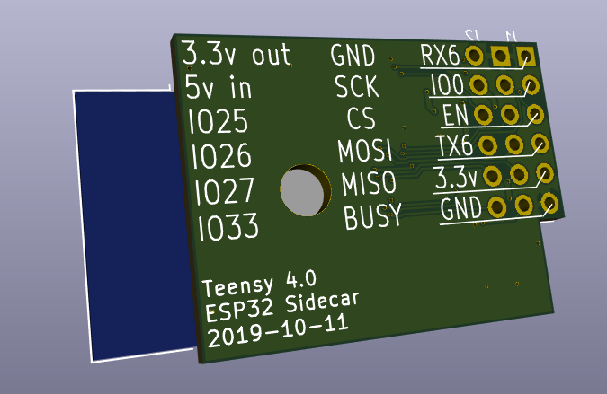

A companion breakout board with an ESP32 module to mate with the [Teensy 4 Header Breakout Board](https://github.com/blackketter/teensy4_header_breakout).  

It's designed to solder to the bottom 8 pins on the right side of the Teensy 4 Header Breakout. 

By default it can be powered by the 3.3v power supply on the Teensy, but this may be insufficient for WiFi transmission.  In that case, populate the power supply parts (C4, C5, U2), cut the 3.3v jumper and provide 5v to the indicated pin.

There's an LED on ESP32 pin IO22.

The switch is connected to the Teensy ON_OFF pin as well as the ESP32 reset pin.

Designed in KiCad.

Notes:

- In progress: First Draft
- With longer header pins you should be able to flip the board to be under or over the Teensy 4.0

Pinout:

Column 1:

1. Teensy D25/RX6, ESP32 TX0/IO1
2. Teensy D26, ESP32 IO0
3. Teensy D28, ESP32 IO2
4. Teensy D24/TX6, ESP32 RX0/IO2
5. Teensy 3.3v
6. GND
7. Teensy Program
8. Teensy On/Off, ESP32 Reset

Column 2:

1. GND
2. ESP32 IO18/SCK
3. ESP32 IO29/CS
4. ESP32 IO14/MOSI
5. ESP32 IO23/MISO

Column 3:

1. 3.3v Regulated
2. 5v Input
3. ESP32 IO25, Green LED out
4. ESP32 IO26, Red LED out
5. ESP32 IO27, Blue LED out