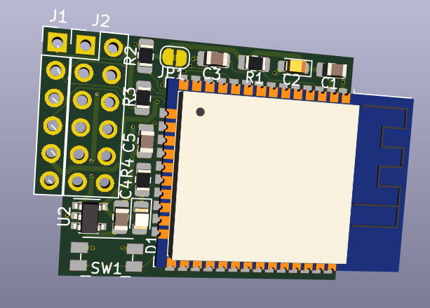

A companion sidecar board with an ESP32 module to mate with the [Teensy 4 Header Breakout Board](https://github.com/blackketter/teensy4_header_breakout).  

It's designed to solder to the bottom 8 pins on the right side of the Teensy 4 Header Breakout. 

By default it can be powered by the 3.3v power supply on the Teensy, but this may be insufficient for WiFi transmission.  In that case, populate the power supply parts (C4, C5, U2), cut the 3.3v jumper and provide 5v to the indicated pin.

There's an LED on ESP32 pin IO22.

Designed in KiCad.

Notes:

- In progress: First version worked, this version in progress.
- With longer header pins you should be able to flip the board to be under or over the Teensy 4.0
- Latest revision connects Teensy pin 28 to ESP32 EN

Pinout:

Column 1:

1. Teensy D25/RX6, ESP32 TX0/IO1
2. Teensy D26, ESP32 IO0
3. Teensy D28, ESP32 EN (Reset), On/Off
4. Teensy D24/TX6, ESP32 RX0/IO2
5. Teensy 3.3v
6. GND

Column 2:

1. GND
2. ESP32 IO18/SCK
3. ESP32 IO5/CS
4. ESP32 IO14/MOSI
5. ESP32 IO23/MISO
6. ESP32 IO32/ESP_BUSY

Column 3:

1. 3.3v Regulated Output (if using onboard regulator)
2. 5v Input To Regulator
3. ESP32 IO25, Green LED out
4. ESP32 IO26, Red LED out
5. ESP32 IO27, Blue LED out
6. ESP32 IO33
